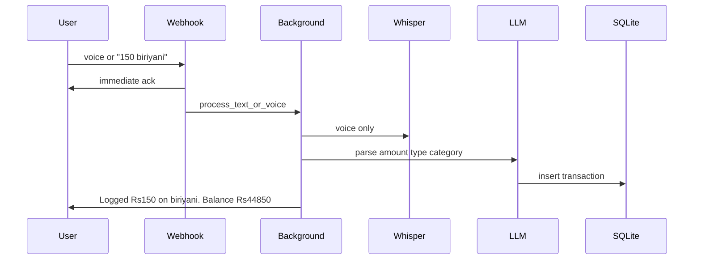

# Expense tracker: LLM parse + SQLite ledger

Lending/borrowing is **out of scope**. Money in is **income**; money out is **expense**. `/balance 45000` is a **set-to-exact** bank sync via an adjustment row.

## Locked decisions

- Currency: INR (`₹`)
- Categories: LLM picks an existing one, or creates a new one (normalize to Title Case to avoid `Food` vs `food`)
- Balance: ledger — `income` and `adjustment` add, `expense` subtracts
- Text and voice share the same pipeline after transcription
- Failed parse: reply with the reason (e.g. Groq error); user can retry by typing
- `/summary`: today / yesterday / this week (Mon–Sun) / this month / custom range
- `/analyze`: calendar month; LLM only narrates **SQL aggregates**
- Edit/delete: `/delete last`, `/delete <id>`, `/edit last ...`, `/edit <id> ...`
- Single user, still store `chat_id`

## End-to-end flow



Webhook in [main.py](main.py) stays fast: ack + `BackgroundTasks`. Groq parse/save happens after the 200 response.

- **Voice:** `"Voice note received."` then background: download → transcribe → parse → save → confirm
- **Plain text (not a command):** `"Got it, logging..."` then same parse → save → confirm
- **Fast commands** (`/help`, `/balance`, `/summary`, `/delete`, `/edit`): handle in the webhook (SQL only)
- **`/analyze`:** SQL aggregates first, then one Groq call for the narrative (usually fast enough to stay in-request; if it fails, reply with the Groq error)

Pass `telegram_message_id` into the background task and skip duplicates if Telegram retries.

## Schema (SQLite)

New [db.py](db.py). Init tables on startup. Path from config, e.g. `expense_tracker.db` (gitignore it).

**`categories`**
- `id`, `name` (unique, normalized), `created_at`

**`transactions`**
- `id`
- `chat_id`
- `type`: `expense` | `income` | `adjustment`
- `amount`: always **positive**; sign comes from `type`
- `category_id`: required for expense; optional for income/adjustment
- `description`, `source_text`
- `telegram_message_id` (unique per chat, for idempotency)
- `created_at`

**Balance rule**

```text
balance = SUM(income.amount) + SUM(adjustment.amount) - SUM(expense.amount)
```

`/balance 45000` does **not** overwrite history. Compute current balance, insert `adjustment` of `(45000 - current)` so the ledger now equals ₹45,000.

`"150 on biriyani"` → expense 150 → balance drops by 150.  
`"got 500"` / `"salary 5000"` → income → balance rises.  
No friend/loan types.

## LLM ([llm.py](llm.py))

Reuse Groq client. Add `LLM_MODEL` to [config.py](config.py) / `.env` (default `llama-3.1-8b-instant`). Use a larger model only for `/analyze` (`llama-3.3-70b-versatile`).

**Parse** (`parse_transaction(text, existing_categories) → dict`)

Prompt: extract JSON only. Pass current category names so the model reuses them when possible.

```json
{
  "is_transaction": true,
  "type": "expense",
  "amount": 150,
  "category": "Food",
  "description": "biriyani"
}
```

- `is_transaction: false` → do not insert; tell the user it did not look like a spend/income
- Validate in Python: `amount > 0`, `type` in allowed set, category Title Case
- On Groq/HTTP failure: return a clear error string (`"Failed: Groq API 500: ..."`)

**Analyze** (`analyze_month(aggregates) → str`): LLM never sees raw rows. Input is SQL totals by category + net balance for that calendar month. Output is a short human-readable spending review.

## Commands ([handlers.py](handlers.py))

| Input | Behavior |
|---|---|
| `/start` `/help` | List commands + examples |
| `/balance` | Current computed balance |
| `/balance 45000` | Adjustment to set exact bank amount; confirm new balance |
| `/summary` | Default: this calendar month, expenses by category |
| `/summary today` `/yesterday` `/week` `/month` | Date windows in Python |
| `/summary 1 Sep to 15 Sep` | Parse range in Python (or a tiny LLM date parse if needed) |
| `/analyze` | This calendar month narrative |
| `/analyze 2026-08` | That month |
| `/last` | Last few transactions with ids (so edit/delete is usable) |
| `/delete last` `/delete 12` | Remove row; balance recalculates from ledger |
| `/edit last 200 biriyani` `/edit 12 amount 200` | Re-parse or patch fields, then save |

Confirmations include **id + new balance**, e.g. `Logged ₹150 on biriyani (Food). Id 12. Balance ₹44,850.`

## File changes

- **New** [db.py](db.py) — connect, `init_db()`, CRUD, `get_balance()`, summary queries, last/get/update/delete
- **New** [llm.py](llm.py) — `parse_transaction`, `analyze_month`
- **Update** [config.py](config.py) — `DB_PATH`, `LLM_MODEL`, `ANALYZE_MODEL`
- **Update** [handlers.py](handlers.py) — command router vs expense/income text
- **Update** [voice.py](voice.py) — after transcribe, call shared `process_transaction(text, chat_id, message_id)` (not echo via `handle_message`)
- **Update** [main.py](main.py) — `init_db()` on startup; pass `message_id`; background for voice **and** non-command text; keep command replies in-request
- **Update** [.gitignore](.gitignore) — `*.db`
- **Update** [.env.example](.env.example) — new vars

No extra Python packages: `sqlite3` is stdlib; Groq SDK already present.

## Shared processing helper

Put `process_transaction(text, chat_id, message_id)` in a small module (e.g. [pipeline.py](pipeline.py) or inside `handlers.py`) so voice and typed `"150 biriyani"` do the same: list categories → LLM parse → insert → format confirmation. Voice pipeline in [voice.py](voice.py) becomes: download → transcribe → `process_transaction` → Telegram follow-up.

## Out of scope

- Lending / borrowing / counterparty names
- Multi-user auth
- Job queue (BackgroundTasks is enough for v1)
